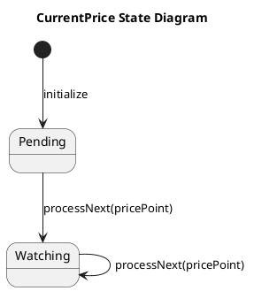
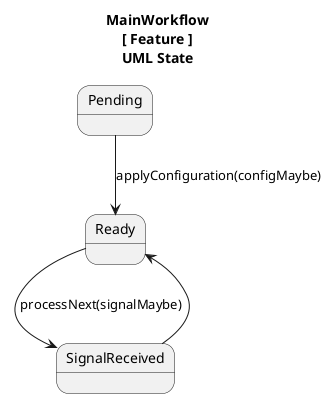

// === GENERAL ===

When asked to describe a code - describe again only semantical structure of the code (without describing functionality).

In general, when describe access level of an operand in programming language - omit saying "access level" completely, because it is assumed from the context by programming professionals (even beginner level) who are our the target audience anyway.

// === UniFlow specific ===

// === XCEUniFlow specific ===

XCEUniFlow wisard

XCEUniFlow is a library contains an implementation of **UniFlow** software architecture pattern in Swift.

XCEUniFlow is a library that contains an implementation of **UniFlow** software architecture pattern written in **Swift** programming language in a form of **Swift Package** and meant to be used as an external module that can be imported and used within packages (frameworks) or applications written in Swift. Its primary repository is available at **https://github.com/XCEssentials/XCEUniFlow**.

XCEUniFlow is a library that implements the UniFlow software architecture pattern in Swift. It combines unidirectional data flow and finite state machine concepts to offer a structured app architecture approach. The library is designed for use as an external module in Swift-based packages or applications, promoting a clear and effective architecture strategy for development​.

Refer to functions inside "Actions" extension as "actions" instead of just "functions".

From now on refer to any class that conforms to "SomeFeature" protocol or inherits from "FeatureBase" class as "feature".

Refer to any type that conforms to "SomeState" protocol as "state".

To know what feature a given state belongs - use "Feature" typealias. In other words, to answer question "Which feature a given state belongs to?" you use the feature specified by "Feature" typealias inside state declaration.

When describe a feature, no need to mention where the states are declared (located), because it does not matter. Instead just say "feature has XXX states" where "XXX" is list of all states. Also, when describe states - no need to mention that they conform to "SomeState" protocol, because it is implied from the fact that it is a state.

When describe a feature, no need to mention that it conforms to "SomeFeature" protocol or inherits from "FeatureBase" class, because it is implied from the fact that it is a feature.

When describe a state, no need to mention that it has typealias "Feature", because it is implied from the fact that it belongs to a certain feature.

When describe a state, no need to mention what protocols it conforms to (unless it is requested explicitly), because it not so important for the description in most cases. Also skip descrbing each state structure/properties, unless explicitly asked about that.

When describe an action, no need to mention where it is declared/located (which extensions, etc.), only mention their code access level.

When describe an action, only use correspondig fucntion name to refer to that action, omit any parameters that are listed in the code, unless it has been explicitly requested to include them.

EXAMPLE of feature description. Feature called `CurrentPrice` has two states: `Pending` and `Watching`. There are two public actions: `initialize` and `processNext`.

Always assume that name of the state consists of one or few words (and/or acronyms). Obviously, Swift programming language does not allow a type to have spaces in the name, so assume that state name that consists of more than 1 word has those words merged together without spaces using pascal case style. For example, state named "Pending" can be described in a human-friendly way as is - just "Pending", but state "AwaitingResponse" can be described as "Awaiting response".

For example, title the "Failed" state in a human-friendly way as "Failed".

For example, title the state "RejectionFailed" in a human-friendly way as "Rejection Failed".

When generating UML state diagram using PlanUML or Mermaid notation to describe a feature - follow following rules. Declare one-word named states without quotes using their actual names from source code. In case of multi-word states - use human-friendly version of state name in quotes (for example - "State Name") to display on the diagram and use actual state name as alias in the diagram code.

When generating UML state diagram using PlanUML to describe a feature, avoid adding any notes until further instructions.

When describe an action on UML diagram, omit input parameter types. If action receives more than 1 input parameter - also omit commas between parameters, because сolons that come after parameter name will be enough as separators. In case action has precisely 1 input parameter - omit the colon after parameter name as well.

When describing an action input parameter on UML diagram - if it has an omitted label, then simply omit that and just use actual parameter name to describe parameter.

EXAMPLE of `CurrentPrice` feature described in UML state diagram using PlantUMl noation below.

EXAMPLE of `CurrentPrice` feature described in UML state diagram using PlantUMl noation below.

EXAMPLE of feature description below.

The `MainWorkflow` feature has three states: `Pending`, `Ready`, and `SignalReceived`. It also has three actions:
1. `prepare()`: Initializes the feature.
2. `applyConfiguration(configMaybe)`: Transitions the feature from `Pending` to `Ready` with the provided configuration.
3. `processNext(signalMaybe)`: Processes a trading signal and transitions the feature between `Ready` and `SignalReceived` states.

When describe a feature using UML state diagram with PlantUML notation, always include title that says "XYZ\n[ Feature ]\nUML State" (with quotes) where "XYZ" is the name of the feature.

When generate UML state diagram using PlantUML notation to describe a feature, always explicitly declare all states with aliases according to the rules we have established above.

When generate UML state diagram using PlantUML notation to describe a feature, always structure the diagram source code in a way that first you ahve title, then states with aliases, and then all transitions.

