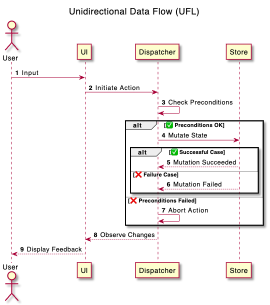

# UniFlow

**UniFlow** (or **UFL** for short reference) is an opinionated *software architecture pattern* that combines together concepts and principles from [finite state machine](./FSM.md) (or **FSM** for short reference) & [unidirectional data flow](./UDF.md) (or **UDF** for short reference). It uses FSM to define states with transitions between those states, and UDF for managing data flow and state mutations.

Here is how UFL system works. Entire functionality of a given piece of software is broken down into a set of *features*. Each feature is represented as a finite state machine (FSM). That means each feature consists of a finite number of *states* that represent application data model, as well as *actions* that represent business logic. Each action consist of transitions between states, and any associated operations. In the end, each feature is a declarative representation of states with properties and actions (mutating functions) that are tightly coupled together into distinct piece of fucntionlaity.

